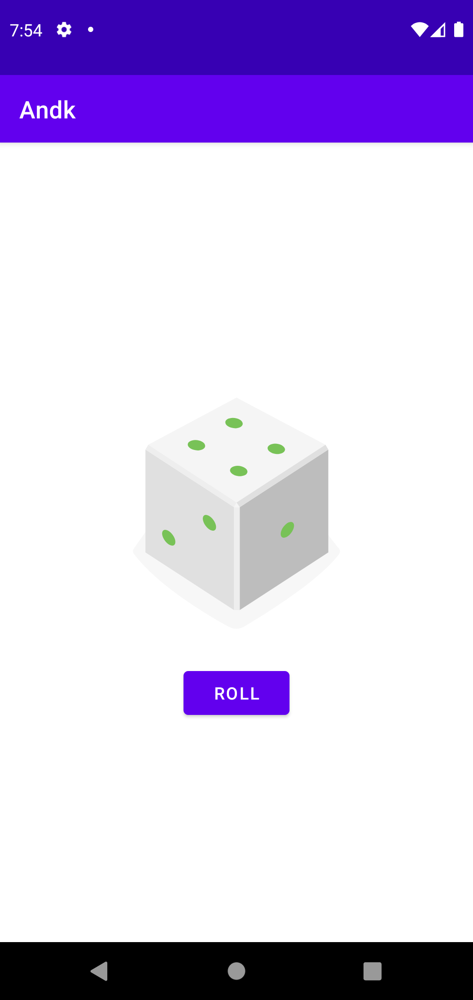

# Andk

[Developing Android Apps with Kotlin](https://classroom.udacity.com/courses/ud9012)

## Lesson 1: Dice Roller
Games often have a random element to them. You could earn a random prize or advance a random number
of steps on the game board. Let's write a program that simulates rolling dice. Each time you roll
the dice, the result can be any number in the range of possible values.

